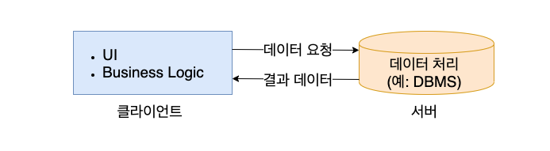
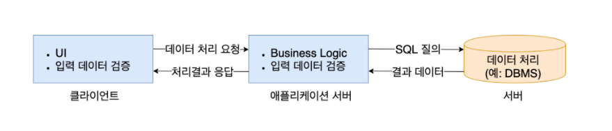

# 클라이언트 , 서버 아키텍처의 진화

클라이언트, 서버(C/S) 아키텍처는 1990년대 중반에 유행했던 방식과 현재의 방식이 다르다.
비주얼 베이직이나  파워빌더, 델파이를 주로 사용하여 C/S 시스템을 구축했던 시대에서 서버는 단지 데이터를 처리하는 역할만
담당했다. 사실 이 시대에서 서버라 하면 DBMS를 가리키는 것이다. 하지만 지금의 웹 애플리케이션 시대에서의 서버는
비즈니스 로직을 수행하는 애플리케이션 서버를 포함하는 말이다. 

## 전통적인 클라이언트,서버 아키텍처

서버는 데이터 처리를 맡고, 클라이언트는 UI와 비즈니스 처리를 담당한다.

즉 데스크톱 애플리케이션의 데이터 처리 부분을 공통화하여 서버로 이관한 것이다. 이렇게 여러 PC에
분산되어 있는 자료를 하나의 서버에서 관리하면 자료의 중복이나 자료가 일치하지 않는 문제를 해소할 수 있다.

`단점`

이 방식의 문제는 프로그램이 변경되면 PC에 다시 설치해야 한다는 것이다. 이전의 메인 프레임 방식에서는 프로그램이
서버에 있어서 서버 쪽만 변경하면 되었지만, C/S 방식에서는 그럴 수 가 없다. 
특히 요즘처럼 글로벌 경쟁이 가속화되는 상황에서는 업무의 변경이 잦아질 수 밖에 없고, 그에 따라 프로그램도 자주 변경해야 한다.

전통적인 C/S 환경에서는 클라이언트가 DBMS로 바로 접속하기 때문에 보안 문제가 발생할 수 있다. 
DBMS에 접속하려면 사용자 아이디와 암호가 필요한데 이것은 보통 프로그램 코드에 들어 있다.
인터넷에 돌아다니는 실행파일 분석기를 사용하면 언제든지 실행 파일로부터 DBMS 접속 정보를 뽑아 볼 수 있기 때문에
치명적인 결과를 낳을 수 있다.

## 개선된 클라이언트 , 서버 아키텍처

이런 문제를 개선하기 위해 클라이언트의 업무 처리 부분은 서버로 이관하고, 클라이언트는 오로지 사용자와의 상호작용을
처리하는 UI 만을 담당하게 되었다.

즉 클라이언트는 데이터를 입력받을 화면을 사용자에게 제공하고, 입력받은 데이터가 형식에 맞는지 검사하고, 필요하다면 서버가
원하는 형식으로 변환하여 서버에 보낸다. 서버로부터 결과를 받으면 사용자가 이해하기 쉽게 화면을 꾸며 출력한다.

업무 처리 부분은 서버에게 위임하는 것이다. 

`애플리케이션 서버`

이렇게 업무 처리를 전담하는 서버를 '애플리케이션 서버'라고 부른다. 애플리케이션 서버는 클라이언트로부터 요청을 받으면
업무 로직에 따라 DBMS 서버를 사용하여 데이터를 처리한다.
또한, 클라이언트의 접근을 제어하여 무효한 접근을 차단하고, 함께 처리해야 할 작업들이 있다면 하나의 트랜잭션으로 묶어서 관리한다.

`특징`

이 방식은 클라이언트가 DB에 직접 접속하지 않기 때문에 DB 접속 정보가 노출되는 사고를 막을 수 있다. 
또한, 업무 처리 부분을 서버로 이전하였기 때문에 서버에서 기능 변경을 하더라도 바로 클라이언트에 적용할 수 있다.

물론 서버 쪽 변경만으로 배포 문제를 완전히 해결할 수는 없지만 어느 정도 잦은 배포를 줄일 수 있다.
만약 클라이언트도 변경해야 한다면 자동 갱신 기법으로 번거로운 배포 문제를 해결할 수 있다.

