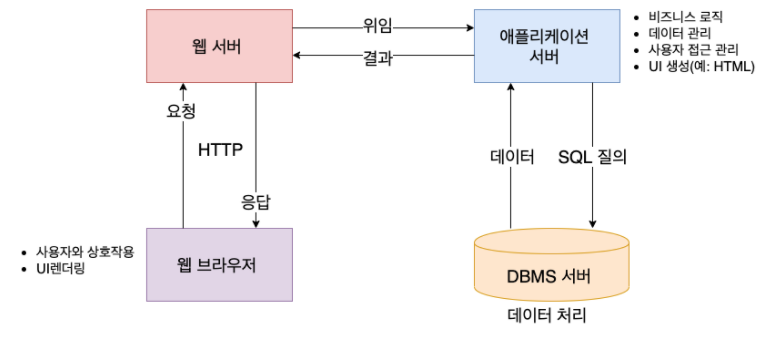
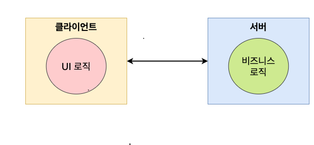
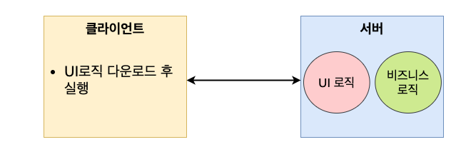
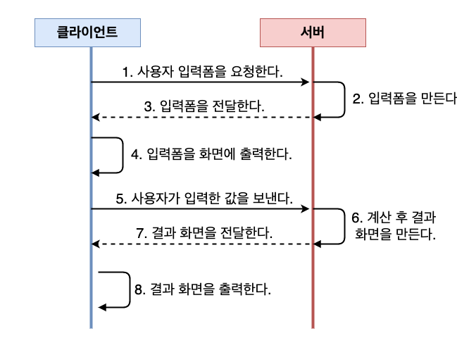
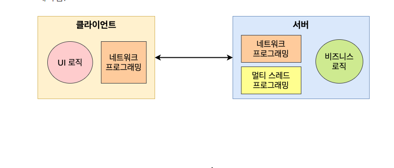
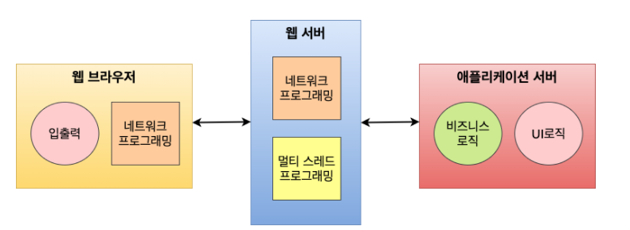

# 웹 애플리케이션 아키텍처의 특징

`웹 애플리케이션 서버 구조`

- 클라이언트와의 통신은 웹 서버가 전담 -> 네트워크 및 스레드 프로그래밍으로부터 탈출
- 애플리케이션 서버는 애플리케이션 실행 및 관리에 집중

## 웹 애플리케이션의 특징

`배치`

기존의 C/S 환경은 비즈니스 처리 부분을 서버에 배치하고 UI 처리 부분을 클라이언트에 배치하였다.
업무가 변경되면 그에 따라 UI도 바뀌어야 하기 때문에 기능이 추가되거나 변경될 때마다 클라이언트 프로그램을 다시 설치해야 하는
문제가 있었다. 

***
웹 한경에서는 비즈니스 로직과 UI 로직을 모두 서버에 배치하기 때문에 기능이 추가되거나 변경되더라도 서버 쪽만 바꾸면 된다.
따라서 배치하는 즉시 사용자는 재설치 없이 추가된 기능이나 변경된 기능을 이용 할 수 있다.

다만, 웹 환경에서는 애플리케이션을 실핼할 때마다 UI 로직을 내려받아야 하기 때문에 네트워크 오버헤드(특정 기능을 수행하기 위해
추가로 사용되는 자원)가 발생한다.

`실행`

웹 환경에서 애플리케이션 실행은 웹 브라우저를 통하여 이루어 진다. 웹 브라우저가 설치되어 있고 인터넷에 연결되어 있다면
어디에서라도 애플리케이션을 실행할 수 잇다. 웹 애플리케이션의 실행 과정은 다음과 같다.

`개발`

C/S 환경에서는 데이터 통신을 위해 네트워크 프로그램이을 해야 한다.
또한, 서버에서는 다중 클라잉너트의 요청을 동시에 처리하기 위해 멀티 스레드 프로그래밍을 해야 한다.

그러나 웹 환경에서는 웹 브라우저와 웹 서버가 그 부분을 대신 처리 해준다.
개발자는 단지 어떤 업무를 처리하고 무엇을 출력할 것인가에 대해서만 고민하면 된다

이제 클라이언트와의 연결을 수행하는 네트워크  관련 코드 & 클라이언트의 요청을 동시에 처리하는 멀티 스레드 관련 코드는

=> 웹 서버와 톰캣 애플리케이션 서버가 대신 처리한다.