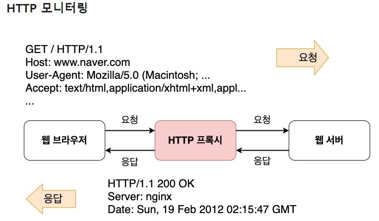

# HTTP 프로토콜의 이해

## HTTP 모니터링
웹 브라우저와 웹 서버사이에 주고받는 데이터를 들여다보려면 HTTP 프록시 프로그램이 필요합니다.

- 웹 브라우저가 웹 서버에게 요청을 하면 HTTP 프록시가 그 요청을 대신 받아서 서버에 전달한다.
- 서버에서 응답이 오면 HTTP 프록시가 그 응답을 대신 받아서 웹 브라우저에게 전달한다.
- 웹 브라우저와 웹 서버의 중간에서 요청이나 응답 내용을 중계해 주기 때문에 둘 사이에서 주고받는 내용이
무엇인지 엿볼 수 있다.
  
`프록시 서버`
: 클라이언트와 서버 사이에서 통신을 중계해 주는 컴퓨터 프로그램을 말한다.
프록시 서버의 주된 용도 중 하나는 빠른 전송을 위하여 서버의 응답 결과를 캐시에 저장해 두는 것이다.
예를 들어 클라이언트가 요청한 것이 캐시(cache: 외부 서버로부터 받은 데이터를 임시 보관해두는 장소)
에 있을 경우 외부 서버에 요청을 전달하지 않고 즉시 캐시에 저장된 내용을 전달하기 때문에 
클라이언트는 빠른 응답 결과를 받게 된다. 
프록시 서버를 두는 두 번째 이유는 보안 때문입니다. 
첨단 기술을 다루는 회사의 경우 내부 사용자의 기밀 유출에 민감할 수밖에 없습니다. 
이런 경우 프록시 서버를 이용하면 외부로 전달되는 데이터를 검사하여 특정 단어가 포함된
자료의 송,수신을 차단하거나 보안 팀에 경고 메세지를 보낼수 있습니다. 

## HTTP 요청
`서버에게 보낸 HTTP 요청 내용`

www.daum.net 의 HTTP 요청 정보의 일부분을 적어보았다.

*General*
1. Request URL: https://www.daum.net/
2. Request Method: GET
3. Status Code: 200 OK

*Response Headers*
1. Cache-Control: no-cache, no-store, must-revalidate
2. Content-Language: ko-KR
3. Content-Type: text/html;charset=UTF-8

*Requests Headers*

1.Accept: text/html,application/xhtml+xml,application/xml;q=0.9,image/avif,image/webp,image/apng,*/*;q=0.8,application/signed-exchange;v=b3;q=0.9
2. Host: www.daum.net
3. Accept-Encoding: gzip, deflate, br

`요청 헤더`

헤더에는 세 가지 종류가 있는데 요청이나 응답 모두에 적용할 수 있는 '일반 헤더(General-header'
와 요청 또는 응답 둘 중 하나에만 적용할 수 있는 '요청 헤더 또는 응답 헤더(Request-header/Response-header'
, 보내거나 받는 본문 데이터를 설명하는 '엔티티 헤더(Entity-header)'가 있습니다.

`HTTP 응답 상태 코드`

<table>
<th>상태 코드</th>
<th>상태 설명</th>
<tr>
<td>200</td>
<td>요청이 성공적으로 처리되었다.</td>
</tr>
<tr>
<td>301</td>
<td>요청한 자원이 이동되었다. 
헤더 정보에 이동 위치를 알려줄 테니 다시 요청하라</td>
</tr>
<tr>
<td>304</td>
<td>클라이언트가 임시 보관한 응답결과와 다르지 않다.</td>
</tr>
<tr>
<td>400</td>
<td>잘못된 요청이다</td>
</tr>
<tr>
<td >404</td>
<td rowspan="3">요청한 자원을 못 찾았다. 서버 내부에서 오류가 발생하였다.</td>
</tr>
<tr>
<td>500</td>
</tr>
</table>