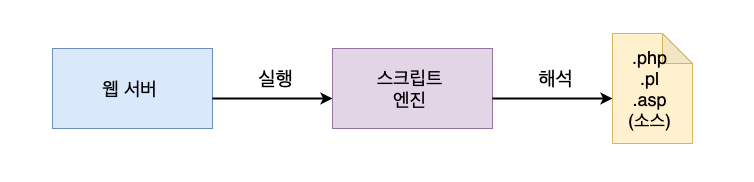

# CGI 프로그램과 서블릿

웹 애플리케이션을 공부하다 보면 'CGI 프로그램' 이라는 용어를 만나게 된다.
그럼 CGI 프로그램이 무엇인지 알아보고 CGI 프로그램은 서블릿 , PHP , Python, Perl
등과 어던 관계가 있는지 보자

### CGI의 이해

사용자가 직접 아이콘을 더블 클릭하거나 명령 창 (또는 터미널)을 통해 실행시키는
프로그램을 일반적으로 '애플리케이션' 또는  '데스크톱 애플리케이션'이라고 한다.

반면에 사용자가 웹 서버를 통해 간접적으로 실행시키는 프로그램이 
'웹 애플리케이션' 이다.

- 웹 브라우저가 웹 서버에게 실행을 요쳥
- 웹 서버는 클라이언트가 요청한 프로그램을 찾아서 실행
- 프로그램은 작업을 수행 한 뒤 그 결과를 웹 서버에 돌려줌
- 웹 서버는 그 결과를 HTTP 형식에 맞추어 웹 브라우저에게 보냄

이때 웹 서버와 프로그램 사이의 데이터를 주고받는 규칙을 CGI(Common Gateway Interface)
라고 한다. 이렇게 웹 서버에 의해 실행되며 CGI 규칙에 따라서 웹 서버와 데이터를 주고
받도록 작성된 프로그램을 'CGI 프로그램'이라고 한다.

`CGI 프로그램`

- C나 C++ , Java와 같은 컴파일 언어로 작성할 수 있다.
- Perl , PHP , Python , VBScript 등 스크립트 언어로도 작성할 수 있음
- 컴파일 방식은 기계어로 번역된 코드를 바로 실행하기 때문에 실행 속도가 빠르다.
- 하지만 , 변경 사항이 발생할 때 마다 다시 컴파일하고 재배포 해야 한다.

  
  

  
- 스크립트 방식은 실행할 때마다 소스 코드의 문법을 검증하고 해석 -> 실행 속도가 느림
- 하지만 변경 사항이 발생하면 단지 소스 코드를 수정하고 저장만 하면 되기 때문에 편리함

### 서블릿

자바 CGI 프로그램은 C/C++ 처럼 컴파일 방식이다.
자바로 만든 CGI 프로그램을 '서블릿(Servlet)' 이라고 부른다.
자바 서블릿이 다른 CGI 프로그램과 다른 점은, 웹 서버와 직접 데이터를 주고 받지
않으며. 전문 프로그램에 의해 관리 된다는 것이다.

`서블릿 컨테이너 `

서블릿의 생성과 실행, 소멸 등 생명주기를 관리하는 프로그램을 '서블릿 컨테이너' 라 한다.
서블릿 컨테이너가 서블릿을 대신하여 CGI 규칙에 따라 웹 서버와 데이터를 주고받는다.
따라서 서블릿 개발자는 더 이상 CGI 규칙에 대해 알 필요가 없다. 대신 서블릿 컨테이너와
서블릿 사이의 규칙을 알아야 한다.

자바 웹 애플리케이션 개발자는 JavaEE 기술 사양에 포함된 Servlet 규칙에 따라  CGI 프로그램을 만들고
배포한다. 