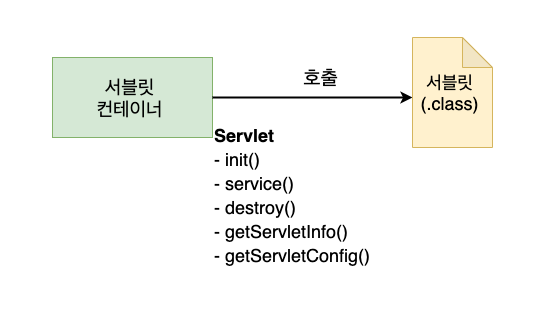
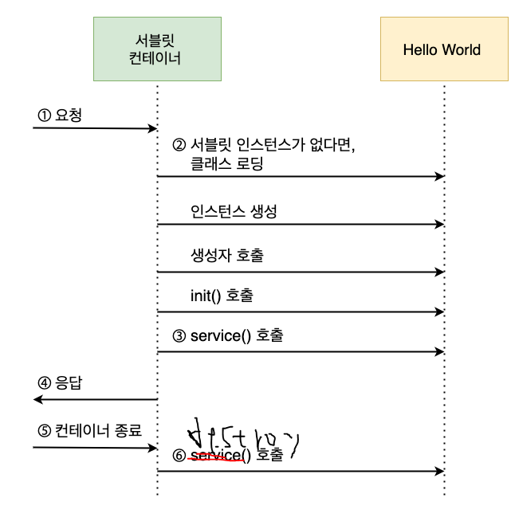

##  javax.servlet.Servlet 인터페이스
서블릿 클래스는 반드시 javax.servlet.Servlet 인터페이스를 구현해야
합니다.
서블릿 컨테이너가 서블릿에 대해 호출할 메서드를 정의한 것이
Servlet 인터페이스입니다.

### 서블릿의 생명주기와 관련된 메소드 : init(), service(), destroy()
Servlet 인터페이스에 정의된 다섯 개의 메서드 중에서 서블릿의
생성과 실행, 소멸, 즉 생명 주기 Lifecycle과 관련된 메서드가
init(), service(), destroy() 입니다.

- init()는 서블릿 컨테이너가 서블릿을 생성한 후 초기화 작업을 수행하기
위해 호출하는 메서드 입니다.
서블릿이 클라이언트의 요청을 처리하기 전에 준비할 작업이 있다면
이 메서드에 작성해야 합니다. 예를 들어 이 메서드가 호출될 때
데이터베이스에 연결하거나 외부 스토리지 서버와의 연결, 프로퍼티 로딩 등
클라이언트 요청을 처리하는데 필요한 자원을 미리 준비할 수 있습니다.

- service()는 클라이언트가 요청할 때 마다 호출되는 메서드입니다.
실질적으로 서비스 작업을 수행하는 메서드 입니다. 바로 이 메서드에
서블릿이 해야 할 일을 작성하면 됩니다. 

- destroy()는 서블릿 컨테이너가 종료되거나 웹 애플리케이션이 멈출 때
또는 해당 서블릿을 비활성화 시킬 때 호출 된다.
따라서 이 메서드에는 서비스 수행을 위해 확보했던 자원을 해제한다거나
데이터를 저장하는 등의 마무리 작업을 작성하면 된다.

`Servlet 인터페이스 기타 메서드 : getServletConfig() , getServletInfo()`

서블릿 생명주기와 관련된 메서드 외에 두 개의 보조 메서드가 더 있다. 이들 메서드는 
서블릿 정보를 추출할 필요가 있을 때 호출하는 메서드이다.

- getServletConfig()는 서블릿 설정 정볼르 다루는 ServletConfig 객체를 반환한다. 

## 서블릿 구동 절차

1. 클라이언트의 요청이 들어오면 서블릿 컨테이너는 서블릿을 찾는다.
2. 만약 서블릿이 없다면, 서블릿 클래스를 로딩하고 인스턴스를 준비한 후
생성자를 호출한다. 그리고 서블릿 초기화 메서드인 init()를 호출한다.
   
3. 클라이언트 요청을 처리하는 service() 메서드를 호출한다.
즉, 클라이언트의 요청에 대해 서비스를 제공한다. 는 뜻이다.
   
4. service() 메서드에서 만든 결과를 HTTP 프로토콜에 맞추어
클라이언트에 응답하는 것으로 요청 처리를 완료한다.
   
5.만약 시스템 운영자가 서블릿 컨테이너를 종료하거나 , 웹 어플리케이션을
종료 한다면,

6. 서블릿 컨테이너는 종료되기 전에 서블릿이 마무리 작업을 수행할 수 있도록
생성된 모든 서블릿에 대해 destroy()메서드를 호출한다.,
   

웹 페이지를 '새로 고침' 하면 서버에 HelloWorld의 실행을 다시 요청한다. 하지만, 이전 요청과 다르게
init()은 호출되지 않고 service()만 호출된다. 그 이유는 이미 HelloWorld 객체가 존재하기 때문이다.

서블릿 컨테이너는 클라리언트로부터 요청을 받으면 해당 서블릿을 찾아 본다. 만약 없다면 해당 서블릿의
인스턴스를 생성한다. 한 번 서블릿 객체가 생성되면 웹 애플리케이션을 종료할 때 까지 유지한다.

`서블릿 인스턴스는 하나만 생성되어 웹 애플리케이션이 종료 될 때까지 사용된다. 따라서 인스턴스 변수에
특정 사용자를 위한 데이터를 보관해서는 안 된다. 또한, 클라이언트가 보낸 데이터를 일시적으로 
보관하기 위해 서블릿의 인스턴스를 사용해서도 안 된다. `

