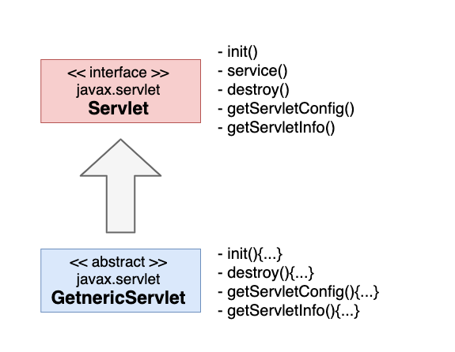

# GenericServlet의 사용

GenericServlet 추상 클래스를 사용하여 서블릿을 만들어 보자.
또한, 웹 브라우저에서 서블릿으로 데이터를 보내는 방법과 
서블릿에서 이 데이터를 꺼내는 방법을 알아보겠습니다. 
서블릿에서 작업한 결과를 웹 브라우저로 보내는 방법도 배워보자


## GenericServlet이 없던 시절
지금까지는 서블릿 클래스를 만들 때 Servlet 인터페이스를 구현하였다.
인터페이스를 구현하려면 인터페이스에 선언된 모든 메서드를 구현해야
하므로, 우리는 서블릿을 만들 때 마다 Servlet 인터페이스에 
선언된 다섯 개의 메서드를 모두 구현하였습니다. 사실 이 메서드 중에서
반드시 구현해야 하는 메서드는 service() 입니다. service()는
클라이언트가 요청할 때 마다 호출되기 때문입니다. 
나머지 메서드들은 상황에 따라 구현하지 않아도 됩니다.

init()의 경우 서블릿이 생성 될 때 딱 한 번 호출되는데, 서블릿을 위해
특별히 준비해야 하는 작업이 없다면 굳이 구현할 필요가 없습니다. 
destroy()는 웹 애플리케이션을 종료할 때 호출되는 데, 서블릿에 대해
마무리할 작업이 없다면 구현할 필요가 없습니다. 
그럼에도 *__'인터페이스를 구현하는 클래스는 반드시 인터페이스에 선언된
모든 메서드를 구현해야 한다'__* 는 자바의 법칙으로 빈 메서드라도
구현해야 한다.

이런 불편한 점을 해소하기 위해 등장한 것이 GenericeServlet 추상
클래스 입니다.

## GenericServlet의 용도

GenericServlet은 추상 클래스라는 말로 짐작할 수 있듯이 하위
클래스에게 공통의 필드와 메서드를 상속해 주고자 존재합니다.
즉 서블릿 클래스가 필요로 하는 init(), destroy(), getServletConfig(),
getServletInfo()를 미리 구현하여 상속 해 준다.
Service()는 어차피 각 서블릿 클랫마다 별도로 구현해야 하기 때문에
GenericServlet에서는 구현하지 않았습니다. 다음은 Servlet
인터페이스와 GenericServlet에서는 추상 클래스의 관계도 입니다.




```java
public class CalculatorServlet extends GenericServlet {
	@Override
	public void service(
			ServletRequest request, ServletResponse response)
			throws ServletException, IOException {


    }
    }
```

Servlet 인터페이스에 선언된 다섯 개의 메서드 중에서 service()를
제외한 나머지 메서드는 이미 GenericServlet에서 구현했기 때문에,
개발자는 오직 service() 만 작성하면 됩니다.
Servlet 인터페이스를 직접 구현하던 때 보다 코드가 훨씬 간결해졌습니다.

### ServletRequest
service()의 매개변수 중에서 ServletRequest 객체는 클라이언트의
요청 정보를 다룰 때 사용한다. 이 객체의 주요 기능 몇가지를 알아보자
예제 소스에서 사용한 getParameter()는  get이나 post 요청으로 들어온 매개변수 값을 꺼낼 때 
사용한다. 

주요 메서드
- getRemoteAddr()
- getSheme()
- getProtocol()
- getParameterNames()
- getParameterValues()
- getParameterMap()
- setCharacterEncoding()


### ServletResponse

ServletResponse 객체는 응답과 관련된 기능을 제공한다.
클라이언트에게 출력하는 데이터의 인코딩 타입을 설정하고, 
문자집합을 지정하며, 출력 데이터를 임시 보관하는 버퍼의 크기를
조정하거나, 데이터를 출력하기 위해 출력 스트림을 준비할 때
이 객체를 사용한다.

`setContentType()`

출력할 데이터의 인코딩  형식과 문자 집합을 지정한다.
이렇게 클라이언트에게 출력할 데이터의 정보를 알려주어야 클라이언트는 그 형식에 맞추어
올바르게 화면을 출력(Rendering)할 수 있다. 

예를 들어 HTML 형식이면 태그 규칙에 맞추어 화면에 출력할 것이고,
XML 형식이면 각 태그를 트리 노드로 표현할 것이다.

아래 코드는 출력할 데이터가 텍스트이고 별도의 메타정보가 없는 순수한 텍스트임을 지정하고 있다.

__response.setContentType("text/plain");__


`setCharacterEncoding()`

출력할 데이터의 문자 집합을 지정한다. 기본값은 ISO-8859-1이다. 아래 코드는 출력할 데이터의
문자 집합을 'UTF-8'로 설정하고 있다. 즉 데이터를 출력할 때 유니코드 값을 UTF-8 형식으로 변환하라는 뜻이다.

__response.setCharacterEncoding("UTF-8");__

만약 문자 집합을 지정하지 않으면 출력하는 모든 문자를 영어로 간주하므로 한글을 "?" 문자로 변환되어
출력된다.


