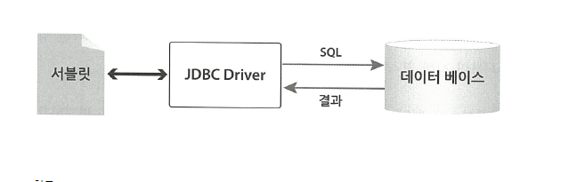

# 데이터베이스에서 데이터 가져오기

서블릿이 하는 주된 일은 클라이언트가 요청한 데이터를 다루는 일이다.
데이터를 가져오거나 입력,변경,삭제 등을 처리하려면 데이터베이스의 도움을 받아야 한다.
데이터베이스는 개발자들이 쉽게 데이터를 저장하고 꺼낼 수 있도록 도와주는 프로그램이다.
데이터베이스가 없다면, 개발자들이 직접 파일 입출력 API를 사용하여 데이터를 다뤄야 한다.

데이터베이스를 사용하려면 두 가지가 필요하다. 첫 번째는 데이터베이스에 요청을 전달하고
결과를 받을 때 사용할 도구 이다. 자바에서는 데이터베이스와의 통신을 위해 JDBC 기술을 제공한다.
두 번째는 데이터베이스에 명령을 내릴 때 사용할 언어이다. SQL(Structured Query Language)
은 데이터를 정의하고 조작할 때 사용하는 데이터베이스를 위한 표준 명령어 이다.

개발자는 SQL로 데이터베이스가 할 일을 작성하고, JDBC를 사용하여 데이터베이스로
SQL을 보내고 결과를 받습니다. 



`데이터베이스 관련 객체의 참조 변수 선언`

service() 에서 처음 부분은 JDBC 객체 주소를 보관할 참조 변수의 선언이다.

```java
Connection conn = null;
Statement stmt = null;
ResultSet rs = null;
```

`데이터베이스 관련 코드를 위한 try~ catch~`

JDBC API를 사용할 때 예외가 발생할 수 있으므로 try ~ catch~ 블록을 준비한다. 

```java
try{

}catch(Exception e){
    throw new ServletException(e);
}finally{
    
}
        
```

try 블록에서 예외가 발생하면 그 예외를 ServletException 객체에 담아서 이 메서드를 호출한 서블릿 컨데이너에 
던진다. 서블릿 컨데이너는 예외에 따른 적절한 화면을 생성하여 클라이언트에게 출력한다.

`DriverManager가 사용할 JDBC 드라이버 등록`

JDBC 프로그래밍의 첫 번째 작업은 DriverManager를 이용하여 java.sql.Driver 인터페이스 구현체를 등록하는 일입니다.
JDBC 드라이버의 문서를 참조하여 해당 클래스를 찾기 바란다.

__DriverManager.registerDriver(new com.mysql.jdbc.Driver());__


MySQL 드라이버의 경우 com.mysql.jdbc.Driver 클래스가 해당 인터페이스를 구현한  클래스이다.
registerDriver()를 호출하여 구현체를 등록한다. com.mysql.jdbc.Driver 클래스는 MySQL 드라이버 파일
(WEB-INF/lib 폴더에 있는 mysql-connector-java-5.1.26-bin.jar)에 들어 있다


`데이터베이스에 연결`

```java
conn = DriverManager.getConnection(
        JDBC URL,
        DBMS 사용자 아이디,
        DBMS 사용자 암호
        )
```


데이터베이스 연결에 성공하면 DB 접속 정보를 다루는 객체를 반환한다.

반환된 객체는 java.sql.Connection 인터페이스의 구현체이다. 이 반환 객체를 통하여 데이터베이스에 SQL 문을
보내는 객체를 얻을 수 있다.

*__java.sql.Connection 인터페이스의 구현체__*

주요 메서드
- createStatement() , prepareStatement() , prepareCall()은 SQL 문을 실행하는 객체를 반환한다.
- commit() , rollback()은 트랜잭션 처리를 수행하는 메서드이다.

즉, 이 구현체를 통해 SQL 문을 실행할 객체를 얻을 수 있다.


`SQL 실행 객체 준비`

Connection 구현체를 이용하여 SQL 문을 실행할 객체를 준비한다.

```java
stmt = conn.createStatement();
```

createStatement()가 반환하는 것은 java.sql.Statement 인터페이스의 구현체이다. 이 객체를 통해 데이터베이스에
SQL 문을 보낼 수 있다. Statement 인터페이스에는 데이터베이스에 질의하는 데 필요한 메서드가 정의되어 있고,
이 인터페이스를 구현했다는 것은 반환 객체가 이러한 메서드들을 가지고 있다는 뜻이다.

즉 반환 객체를 이용하면 SQL 문을 서버에 보낼 수 있다.

*__java.sql.Statement 인터페이스의 구현체__*

주요 메서드

- executeQuery() : 결과가 만들어지는 SQL 문을 실행할 때 사용한다. 보통 select 문을 실행한다.
- executeUpdate() : DML과 DDL 관련 SQL 문을 실행할 때 사용한다. DML에는 insert , update , delete 명령문이
있고 , DDL은 create , alter , drop 명령문이 있다.
