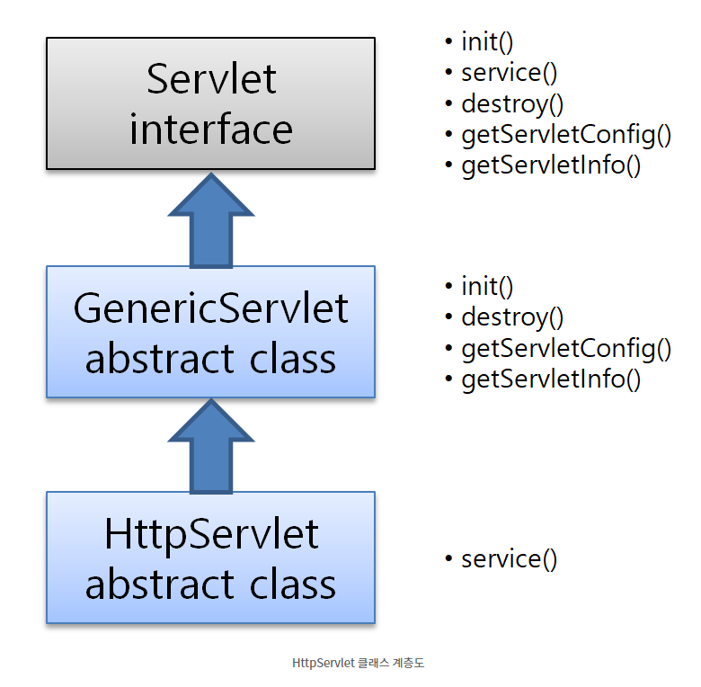
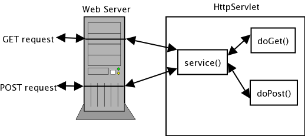

# HttpServlet으로 GET 요청 다루기

지금까지 서블릿 클래그를 만들 대 service() 메서드를 정의하였는데, HttpServlet 클래스를 상속받게 되면
service() 대신 doGet() 이나 doPost()를 정의한다.


URL 이 '/'으로 시작하면 절대 경로이고 '/'으로 시작하지 않으면 상대 경로이다.

`절대 경로 URL`

절대 경로는 웹 서버 루트를 기준으로 계산한다. 만약 링크 URL이 '/web04/member/add' 라면
실제 URL을 계산해 보면 다음 그림과 같다.


URL의 절대 경로 계산법

- 서버 루트 :` http://localhost:9999`
- 최종 경로 : `http://localhost:9999/web04/member/add`
- 절대 경로 : `/web04/member/add`


`HttpServlet 클래스`

```java
public class MemberAddServlet extends HttpServlet{
    
}
```

GenericServlet 클래스 대신 HttpServlet 클래스를 상속받았다.
HttpServlet 클래스는 GenericServlet 클래스의 하위 클래스이다. 따라서 HttpServlet을 상속 받으면 
GenericServlet 클래스를 상속받는 것과 마찬가지로 javax.servlet.Servlet 인터페이스를 구현한 것이 된다.



서블릿 컨테이너는 Servlet 규칙에 정의된 메서드를 호출하기 때문에 서블릿 객체는 반드시 Servlet 인터페이스를
구현해야 한다. 

```java
	protected void doGet(HttpServletRequest request, HttpServletResponse response) throws ServletException, IOException {
    
        }
```

HttpServlet 클래스에 정의된 메서드 중에서 doGet() 메서드를 오버라이딩 한다. doGet() 메서드 안에 
이 클래스가 해야 할 일을 작성한다. 클라이언트 요청이 들어오면 서블릿 컨테이너는 service()를 호출하기 때문에
지금까지 서블릿을 만들 때 service() 메서드를 작성하였다.
그런데 뜬금없이 doGet()을 작성한다고 하니 이상하다 

그 이유는 다음과 같다.



클라이언트 요청이 들어오면, 첫째로 상속받은 HttpServlet의 service() 메서드가 호출되고, 둘째로 service()는
클라이언트 요청 방식에 따라 doGet() 이나 doPost() , doPut() 등의 메서드를 호출한다.
따라서 HttpServlet을 상속 받을 때 service() 메서드를 직접 구현하기 보다 클라이언트의 요청 방식에 따라
doXXX() 메서드를 오버라이딩 한다.

