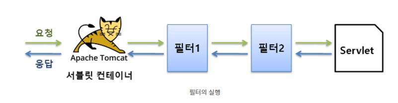

# 필터 사용하기

필터는 서블릿 실행 전후에 어떤 작업을 하고자 할 때 사용하는 기술이다.
예를 들면 클라이언트가 보낸 데이터의 암호를 해제한다거나, 서블릿이 실행되기 전에 필요한 자원을 미리 준비한다거나,
서블릿이 실행 될 때마다 로그를 남긴다거나 하는 작업을 필터를 통해 처리할 수 있다.




만약에 이런 작업들을 서블릿에 담는다면 서블릿마다 해당 코드를 삽입해야하고, 필요가 없어지면 그 코드를
삽입한 서블릿을 모두 찾아서 제거해야 하므로 관리하기가 매우 번거롭다.

### 필터

필터에서 POST 요청으로 넘어온 매개변수의 문자 집합을 설정해보자
POST 요청인 경우 서버로 보내는 데이터는 메세지 바디에 있는데 서블릿에서 이 데이터를 꺼내려면
getParameter()를 호출해야 합니다.만약 메세지 바디에 한글과 같은 멀티바이트 문자가 있을 때
그냥 getParameter()를 호출하면 한글이 깨집니다.


이를 해결하기 위해 다음과 같이 setCharacterEncoding()을 호출하여 메세지 바디의 데이터가 어떤 문자집합으로
인코딩 되었는지 설정하였습니다. 이렇게 해야만 올바르게 변환된 유니코드 값을 얻을 수 있습니다.

```java
request.setCharacterEncoding("UTF-8");
```

그러나 각 서블릿 마다 앞의 코드를 작성하는 것은 매우 번거로운 일입니다. 
바로 이럴 때 서블릿 필터를 이용하면 간단히 처리할 수 있습니다.

### 필터 만들기

```java
public class CharacterEncodingFilter implements Filter{
	FilterConfig config;
	
	@Override
	public void init(FilterConfig config) throws ServletException {
		this.config = config;
	}
	
	@Override
	public void doFilter(
			ServletRequest request, ServletResponse response,
			FilterChain nextFilter) throws IOException, ServletException {
		request.setCharacterEncoding(config.getInitParameter("encoding"));
		nextFilter.doFilter(request, response);
	}

	@Override
	public void destroy() {}
}
```

필터가 되려면 예제 소스와 같이 반드시 javax.servlet.Filter 인터페이스를
구현해야 합니다. 필터는 서블릿과 마찬가지로 한 번 생성되면
웹 애플리케이션이 실행되는 동안 계속 유지됩니다.


### init()

init() 메서드는 필터 객체가 생성되고나서 준비 작업을 위해 딱 한 번 호출됩니다.
Servlet 인터페이스의 init()와 같은 용도입니다. 이 메서드의 매개변수는 FilterConfig 객체입니다.
이 객체를 통해 필터 초기화 매개변수의 값을 꺼낼 수 있습니다.  예제 코드를 보면 이 객체를
doFilter()에서 사용하기 위해 인스턴스 변수에 저장하였습니다.
```java
this.config = config;
```

### doFilter()

필터와 연결된 URL에 대해 요청이 들어오면 doFilter()가 항상
호출됩니다. 이 메서드에 필터가 할 일을 작성하면 됩니다.
```java
@Override
	public void doFilter(
			ServletRequest request, ServletResponse response,
			FilterChain nextFilter) throws IOException, ServletException {
		// 서블릿이 실행되기 전에 해야 할 작업 
        
        // 다음 필터를 호출. 더이상 필터가 없다면 서블릿의 service()가 호출됨
		nextFilter.doFilter(request, response);
		
		// 서블릿을 실행한 후, 클라이언트에게 응답하기 전에 해야할 작업
	}
```


1. nextFilter 매개변수는 다음 필터를 가리킨다.
2. nextFilter.doFilter()는 다음 필터를 호출한다. 다음 필터가
없다면 내부적으로 서블릿의 service() 메서드를 호출한다.
   
3. 만약 서블릿이 실행되기 전에 처리할 작업이 있다면 nextFilter.doFilter()
호출 전에 작성한다.
   
4. 만약 서블릿이 실행 된 후에 처리할 작업이 있다면 nextFilter.doFilter()
를 호출하는 코드 다음에 작성한다.