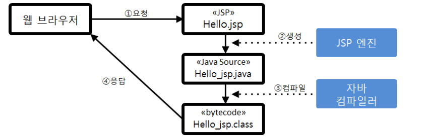
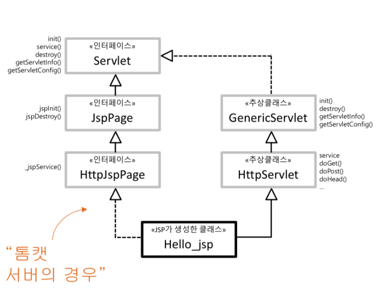

# 뷰 컴포넌트와 JSP

### JSP 구동 원리

JSP 기술의 가장 중요한 목적은 콘텐츠를 출력하는 코딩을 단순화하는 것이다. 어떤 원리로 이것이 가능한지 알아보자

1. 개발자는 서버에 JSP 파일을 작성해 둔다. 클라이언트가 JSP를 실행해 달라고 요청하면 , 서블릿 컨테이너는
JSP 파일에 대응하는 자바 서블릿을 찾아 실행한다.
   
2. 만약 JSP에 대응하는 서블릿이 없거나 JSP 파일이 변경되었다면, JSP 엔진을 통해 JSP 파일을 해석하여
서블릿 자바 소스를 생성한다.
   
3. 서블릿 자바 소스는 자바 컴파일러를 통해 서블릿 클래스 파일로 컴파일 된다. JSP 파일을 바꿀 때마다 이 과정을 
반복 한다.
   
4. JSP로 부터 생성된 서블릿은 서블릿 구동 방식에 따라 실행된다. 즉 서블릿의 service() 메서드가 호출되고,
출력 메서드를 통해 서블릿이 생성한 HTML 화면을 웹 브라우저로 보낸다.
   
JSP를 사용하면 개발자는 자바로 출력문을 작성할 필요가 없다.  JSP 엔진이 자바  출력문을  만들기 때문에
웹 브라우저로 출력할 HTML을 작성하기가 매우 쉬워진다. 이런 이유로 뷰 컴포넌트를 만들 때 JSP를 사용한다.
즉 JSP는 서블릿 자바 파일을 만들기 위한 템플릿으로 사용된다. 

### HttpJSpPage 인터페이스

