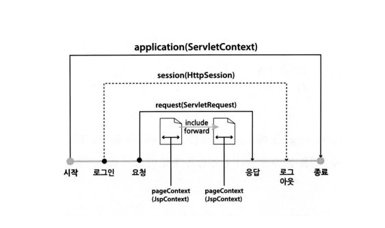

# 데이터 보관소
서블릿들이 서로 협력하여 작업을 수행할 때, 데이터를 공유하는 방법을 알아보겠습니다.
서블릿 기술은 데이터를 공유하기 위한 방안으로 네 가지 종류의 데이터 보관소를 제공한다.
각각의 데이터 보관소는 공유 범위를 기준으로 구분된다.



1. ServletContext 보관소 
   - 웹 애플리케이션이 시작될 때 생성되어 웹 애플리케이션이 종료 될 때까지 유지된다. 이 보관소에 데이터를 보관하면
    웹 애플리케이션이 실행되는 동안에는 모든 서블릿이 사용할 수 있다. JSP에서는 application 변수를 통해
     이 보관소를 참조 할 수 있다. 
2. HttpSession 보관소
   - 클라이언트의 최초 요청 시 생성되어 브라우저를 닫을 때까지 유지된다. 보통 로그인할 때 이 보관소르 초기화하고,
    로그아웃하면 이 보관소에 저장된 값들을 비운다. 따라서 이 보관소에 값을 보관하면 서블릿이나 JSP 페이지에
     상관없이 로그아웃 하기 전까지 계속 값을 유지할 수 있다. JSP에서는 session 변수를 통해 이 보관소를 참조
     할 수 있다. 
3. ServletRequest 보관소
   - 클라이언트의 요청이 들어올 때 생성되어, 클라이언트에게 응답 할 때까지 유지된다. 이 보관소는 
    포워딩이나 인클루딩하는 서블릿들 사이에서 값을 공유할 때 유용하다. JSP에서는 request 변수를 통해
     이 보관소를 참조 할 수 있다.
4. JspContext 보관소 
    - JSP 페이지를 실행하는 동안만 유지된다. JSP 에서는 pageContext 변수를 통해 이 보관소를 참조할 수 있다.


*__보관소에 값을 넣고 빼는 방법은 모두 같다.__*

다음의 메서들르 호출하여 값을 저장하고 조회할 수 있다.

> 보관소 객체.setAttribute(키 , 값); // 값 저장
> 
> 보관소 객체.getAttribute(키) // 값 조회

## ServletContext의 활용

ServletContext 객체는 웹 애플리케이션이 시작될 때 생성되어, 웹 애플리케이션이 종료될 때까지
유지되는 객체라고 하였다. 이 객체 값을 보관하면 웹 애플리케이션이 종료될 때까지 모든 서블릿이
이용할 수 있다. 즉 어떤 객체를 웹 애플리케이션이 실행되는 동안 모든 서블릿들과 공유하고 싶다면
이 보관소에 저장하면 된다.

지금까지 데이터베이스를 사용하는 서블릿들은 모두, 호출될 때마다 데이터베이스 커넥션을 생성했다.
이 데이터베이스 커넥션 객체를 웹 애플리케이션이 시작될 때 생성하여 ServletContext에 저장하자
이렇게 하면 데이터베이스를 이용하는 모든 서블릿은 ServletContext에서 DB 커넥션 객체를
얻을 수 있다.

`공유 자원을 준비하는 서블릿 작성`

웹 어플리케이션이 시작 될 때 데이터베이스 커넥션 객체를 준비하는 서블릿을 작성

*AppInitServlet.java*
```java

public class AppInitServlet extends HttpServlet {
	
	@Override
	public void init(ServletConfig config) throws ServletException {
		System.out.println("AppInitServlet 준비..");
		super.init(config);
		try {
			ServletContext sc = this.getServletContext();
			Class.forName(sc.getInitParameter("driver"));
			Connection conn = DriverManager.getConnection(sc.getInitParameter("url"),
					sc.getInitParameter("username"),
					sc.getInitParameter("password"));
			// 데이터베이스 커넥션 객체를 준비 다 한 뒤, ServletContext 객체에 저장
					sc.setAttribute("conn", conn);		
		} catch (Exception e) {
			// TODO: handle exception
		}
	}
	
	@Override
	public void destroy() {
		System.out.println("AppInitServlet 마무리..");
		super.destroy();
		Connection conn =
				(Connection) this.getServletContext().getAttribute("conn");
		
		try {
			if(conn!=null && conn.isClosed() == false) {
				conn.close();
			}
		} catch (Exception e) {
			// TODO: handle exception
		}
	}

}
```

지금까지 서블릿을 만들 때, service()를 직접 오버라이딩 하거나 또는 doGet(), doPost()를
오버라이딩 했다. 하지만, 이번 서블릿은 클라이언트에서 호출할 서블릿이 아니므로 이런
메서드들을 오버라이딩 하지 않는다. 대신 init()를 오버라이딩 하였다.
init()은 서블릿 객체가 생성될 때 딱 한 번 호출되기 때문에 공유 자원을 준비하는 코드가 놓이기에
최적의 장소라 할 수 있다.

init()의 두 번째 라인
```java
super.init(config);
```
은 오버라이딩 하기 전의 메서드를 호출한다. 슈퍼 클래스 HttpServlet으로부터 상속 받은
init()의 기능을 그대로 수행하겠다는 의미다. 즉 상속받은 기능은 그대로 두고
새로운 작업을 추가하는 것이다.

그리고 나머지 코드들은 데이터베이스 커넥션을 준비하는 명령어이다. 여기서 중요한 것은 데이터베이스
커넥션 객체를 준비한 다음, 모든 서블릿들이 사용할 수 있도록 ServletContext 객체에 저장하는 일이다.

```java
sc.setAttribute("conn" , conn);
```

"conn" 이라는 키를 사용하여 저장했기 때문에 꺼낼 때도 이 키를 사용하여 꺼내면 된다.

destroy()는 서블릿이 언로드 될 때 호출된다. 서블릿이 언로드 되는 때는 관리자가 톰캣 서버를 종료하거나,
웹 애플리케이션이 종료하거나, 해당 서블릿을 다시 로딩할 때입니다.

AppInitServlet의 destroy()를 살펴보면 init()에서 준비했덙 DB 커넥션 객체를 해제시키고 있다.

즉, 데이터베이스와의 연결을 끊는 것이다.

```java
if(conn!= null && conn.isClosed() == false){
    conn.close();
}
```

```java
super.destroy();
```

destroy()도 init()처럼 오버라이딩 되기 전의 상속받은 메서드를 호출함으로써 원래의 마무리 작업은 유효하게 처리할 것이다.


## HttpSession 의 활용 - 로그인

HttpSession 객체는 클라이언트 당 한 개가 생성된다. 웹 브라우저로부터 요청이 들어오면, 그 웹 브라우저를 위한
HttpSession 객체가 있는지 검사하고, 없다면 새로 HttpSession 객체를 만든다. 이렇게 HttpSesison 객체는
그 웹 브라우저로부터 일정 시간 동안 Timeout 요청이 없으면, 삭제 된다. 따라서 로그인 되어 있는 동안
지속적으로 사용할 데이터를 HttpSession 객체에 저장한다.


1. 웹 브라우저에서 '/auth/login' 서블릿을 요청한다.
2. LogInServlet은 LoginForm.jsp로 화면 출력 작업을 위임한다.
3. LoginForm.jsp는 로그인 입력폼을 만들어 출력한다.
4. 사용자가 입력한 정보를 가지고 다시 '/auth/login' 서블릿을 요청한다. 단 이번에는 POST 요청이다.
5. LogInServlet은 이메일과 암호가 일치하는 회원 정보를 데이터베이스에서 찾아서 값 객체 'Memnber'에 담는다.
또한 다른 서블릿들도 참조할 수 있도록 HttpSession 객체에 보관한다. 만약 이메일과 암호가 일치하는 회원을 찾지 못한다면,
   LoginFail.jsp로 작업을 위임한다.
   
6. 로그인 성공일 때, 회원 목록 페이지로 리다이렉트 한다. 로그인 실패시 로그인 실패 메세지를 출력한 후
다시 로그인 입력폼으로 리프래시 한다.
   

## HttpSession 의 활용 - 로그인 정보 사용

LoginServlet에서 HttpSession 보관소에 저장한 Member 객체를 Header.jsp에서 꺼내 보자

1. 로그인 성공일 때, 서버로부터 리다이렉트 응답을 받는다. 즉시 웹 브라우저는 톰캣 서버에 리다이렉트
URL(/member/list)을 요청한다.
   
2. MemberListServlet은 데이터베이스에서 회원 목록을 가져온 후, MemberList.jsp에게 화면 출력 작업을 위임한다.

3. MemberList.jsp는 화면 상단의 내용을 출력하기 위해 Header.jsp를 인클루딩 한다.

4. Header.jsp는 HttpSession 객체에 보관된 로그인 회원의 정보(Member 객체)를 꺼낸다.

5. 또한 Header.jsp는 Member 객체로부터 이름을 추출하여 로그인 사용자 정보를 출력한다.

6. MemberList.jsp는 화면 하단의 내용을 출력하기 위해 Tail.jsp를 인클루딩 한다.

7. MemberListServlet은 MemberList.jsp가 작업한 내용을 최종적으로 출력함으로써 응답을 완료한다.

`Header.jsp`

```java
<%@page import="spms.vo.Member"%>
<%@ page language="java" contentType="text/html; charset=UTF-8"
    pageEncoding="UTF-8"%>
<jsp:useBean id="member"
  scope="session"
  class="spms.vo.Member"/>
<div style="background-color:#00008b;color:#ffffff;height:20px;padding: 5px;">
SPMS(Simple Project Management System)
<% if (member.getEmail() != null) { %>
<span style="float:right;">
<%=member.getName()%>
<a style="color:white;" 
  href="<%=request.getContextPath()%>/auth/logout">로그아웃</a>
</span>
<% } %>
</div>
```


## ServletRequest의 활용

ServletRequest 객체에 데이터를 보관하면 포워딩이나 인클루딩을 통해 협업하는 서블릿(JSP 포함)끼리
데이터를 공유할 수 있다. 이유는 request와 response를 같이 사용하기 때문이다.

```java
 protected void doGet(
      HttpServletRequest request, HttpServletResponse response)
          throws ServletException, IOException {
    RequestDispatcher rd = request.getRequestDispatcher(
        "/auth/LogInForm.jsp");
    rd.forward(request, response);
  }
```

앞의 코드를 보면 forward()를 호출할 때 doGet()의 매개변수 값을 그대로 넘겨 주고 있다.


## JspContext의 활용

JspContext 보관소는 JSP 페이지를 실행할 때 생성되고, 실행이 완료되면 이 객체는 제거 된다.
따라서 JSP 페이지 내부에서만 사용될 데이터를 공유할 때 사용한다. 
