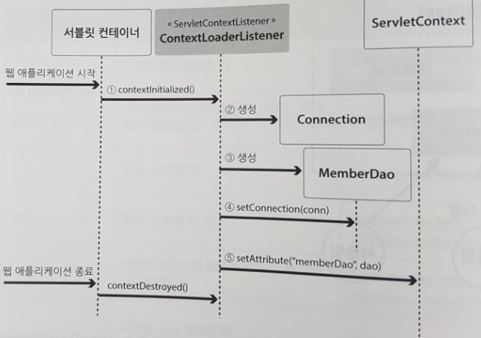

#  ServletContextListener 와 객체 공유

서블릿 컨테이너는 웹 애플리케이션의 상태를 모니터링 할 수 있도록 웹 애플리케이션의 시작에서
종료까지 주요한 사건에 대해 알림 기능을 제공합니다. 이런 알림 기능을 이용하고 싶다면,
규칙에 따라 객체를 만들어 DD 파일(web.xml)에 등록하면 된다. 이렇게 사건이 발생했을 때
알림을 받는 객체를 '리스너(Listener)'라고 부른다.

### 웹 애플리케이션
- javax.servlet.ServletContextListener / 시작하거나 종료할 때
- javax.servlet.ServletContextAttributeListener 
### 세션
### 요청

서블릿은 요청을 처리하기 위해 매번 DAO 인스턴스를 생성한다. 이렇게 요청을 처리할 때마다
객체를 만들게 되면 많은 가비지(garbage)가 생성되고, 실행 시간이 길어진다.
서비스를 요청하는 클라이언트가 적을 경우에는 문제가 되지 않지만, 요청이 많아진다면 부담이 된다.

DAO의 경우처럼 여러 서블릿이 사용하는 객체는 서로 공유하는 것이 메모리 관리나 실행 속도 측면에서
좋다. DAO를 공유하려면 ServletContext에 저장하는 것이 좋다. 

ServletContext는 웹 애플리케이션이 종료될 때 까지 유지되는 보관소이기 때문이다.

웹 애플리케이션이 시작되거나 종료되는 사건이 발생하면, 이를 알리고자 서블릿 컨테이너는 리스너의
메서드를 호출한다. 바로 이 리스너에서 DAO를 준비하면 된다. DAO 뿐만 아니라 
APPInitServlet이 하던 일도 이 리스너에서 처리하면 된다. 

## ServletContextListener 의 활용

웹 애플리케이션의 시작과 종료 사건을 담당할 리스너를 준비한다.
AppInitServlet이 하던 일을 이 리스너로 옮긴다. 또한 , MemberDao의
인스턴스 생성도 이 리스너에서 준비한다. 

1. 웹 애플리케이션이 시작되면 , 서블릿 컨테이너는 ServletContextListner의 구현체에 대해 contextInitialized()
메서드를 호출한다.
   
2. 리스너는 DB 커넥션 객체를 생성한다.

3. 리스너는 DAO 객체를 생성한다.

4. 그리고 DB 커넥션 객체를 DAO에 주입한다.

5. 서블릿들이 DAO 객체를 사용할 수 있도록 ServletContext 보관소에 저장한다.

6. 만약 웹 애플리케이션이 종료되면, 서블릿 컨테이너는 리스너의 contextDestroyed() 메서드를 호출한다. 