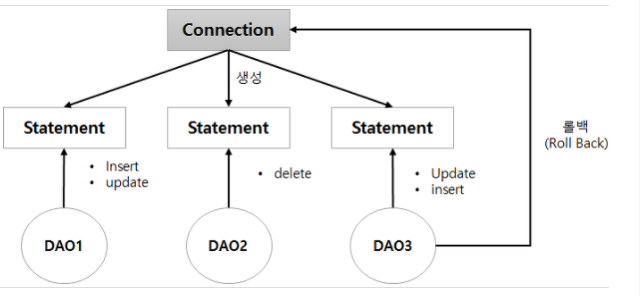

# DB 커넥션 풀

DB 커넥션 풀은 DB 커넥션 객체를 여러 개 생성하여 풀에 담아 놓고 필요할 때 꺼내 쓰는 방식이다.
즉 , 자주 쓰는 객체를 미리 만들어 두고, 필요할 때마다 빌리고, 사용한 다음 반납하는 방식을 
'풀링(pooling')이라 합니다. 이렇게 여러 개의 객체를 모아둔 것을 '객체 풀(object pool)'이라고
하고, 여러 개의 DB 커넥션을 관리하는 객체를 'DB 커넥션 풀' 이라고 부른다.

사용이 끝난 DB 커넥션 객체는 다른 작업에서 다시 쓸 수 있도록 풀에 반환한다.

지금까지는 DB 커넥션 객체를 하나만 만들어 사용했다. 테스트할 때도 잘 실행되었는데
DB 커넥션 객체를 여러 개 생성할 필요가 있을까? 

앞의 그림에서 DAO 1,2,3,이 사용하는 Statement는 같은 커넥션에서 생성한 객체이다.
SQL문을 실행하다 보면 DAO 3 처럼 예외가 발생했을 때 이전 상태로 되돌려야 할 경우가 있다.
이렇게 작업하기 전 상태로 되돌리는 것을 '롤백(rollback)' 이라고 하는데,  안타깝게도
Statement 객체에는 롤백 기능이 없다. 커넥션 객체를 통해서만 롤백을 수행할 수 있다.

문제는 앞의 그림에서처럼 DAO 3가 커넥션 객체의 롤백 기능을 호출할 경우, 그 커넥션을 통해
이루어지는 다른 모든 작업도 롤백 된다는 것이다.
즉 DAO 1,2가 작업한 것까지 이전 상태로 되돌려진다. 따라서 웹 브라우저의 요청을 처리할 때,
각 요청에 대해 개별 DB 커넥션을 사용해야 한다.

이전까지 하나의 DB 커넥션을 공유하여 웹 브라우저의 요청을 처리하였다.
만약 어떤 요청을 처리하다가 예외가 발생하여 롤백한다면 , 다른 요청에 대해 작업한 내용까지
모두 롤백 되는 치명적인 문제를 안고있다. 이를 해결하겠다고 다시 이전과 같이 SQL 작업을
할 때마다 DB 커넥션 객체를 생성한다면, 다시 예전 처럼 실행 속도가 느려지고 
많은(Garbage)가 생성될 것이다. 커넥션 객체를 생성하는 데 속도가 느려지는 이유는,
커넥션을 맺을 때마다 데이터베이스 서버는 사용자 인증과 권한 검사를 수행하고 
요청 처리를 위한 준비 작업을 해야 하기 때문이다.

이런 문제를 해결하기 위해 등장한 것이 DB 커넥션 풀이다. DB 커넥션 풀을 이용하면, 각 요청에 대해
별도의 커넥션 객체를 사용하기 때문에 다른 작업에 영향을 주지 않는다. 또한 사용한 DB 커넥션 객체는
버리지 않고 풀에 보관해 두었다가 다시 사용하기 때문에, 가비지가 생성 되지 않고 속도도 빨라진다.
