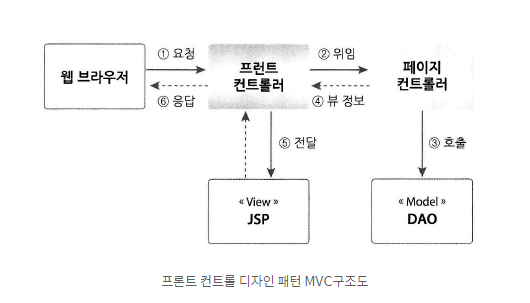

# 프런트 컨트롤러의 도입

프런트 컨트롤러라는 디자인 패턴을 이용하여 좀 더 유지보수가 쉬운 구조로 MVC를 개선 할 수 있다.
컨터를러를 만들다 보면 요청 데이터를 처리하는 코드나 모델과 뷰를 제어하는 코드가 중복되는 경우가
있다. 중복 코드들은 유지보수를 어렵게 하므로 프런트 컨트롤러를 통해 이 문제를 해결해보자

### 프런트 컨트롤러의 패턴



1. 웹 브라우저에서 요청이 들어오면, 제일 먼저 프런트 컨트롤러에서 그 요청을 받는다. 
프런트 컨트롤러는 VO 객체를 생성하여 클라이언트가 보낸 데이터를 담는다. 그리고
   ServletRequest 보관함에 VO 객체를 저장한다. 요청 URL에 따라 페이지 컨트롤러를 선택하여
   실행을 위임한다.
   
2. 페이지 컨트롤러는 DAO를 사용하여 프런트 컨트롤러로부터 받은 VO 객체를 처리한다.
3. DAO는 페이지 컨트롤러부터 받은 데이터를 처리한다.
4. DAO 호출이 끝나면, 페이지 컨트롤러는 화면을 만들 때 사용할 데이터를 준비한다. 그리고
JSP 사용할 수 있도록 ServletRequest 보관소에 저장한다. 프런트 컨트롤러에게 화면 출력을
   담당할 뷰 정보(JSP의 URL)를 반환한다.
   
5. 프런트 컨트롤러는 페이지 컨트롤러가 알려준 JSP로 실행을 위임한다. 
만약 오류가 발생한다면 '/Error.jsp'로 실행을 위임한다.
   
6. JSP는 페이지 컨트롤러에서 준비한 데이터를 가지고 화면을 생성하여 출력한다.
프런트 컨트롤러는 웹 브라우저의 요청에 대한 응답을 완료한다.
   

이전에 배운 MVC는 컨트롤러가 하나였지만, '프런트 컨트롤러' 디자인 패턴에서는 두 개의
컨트롤러를 사용하여 웹 브라우저 요청을 처리한다. 즉, 기본에 서블릿이 단독으로 하던
작업을 프런트 컨트롤러와 페이지 컨트롤러로, 이렇게 두 개의 역할로 나누어 수행한다.

프런트 컨트롤러는 VO 객체의 준비, 뷰 컴포넌트의 위임, 오류 처리 등과 같은 공통 작업을 담당하고,
페이지 컨트롤러는 이름 그대로 요청한 페이지만을 위한 작업을 수행한다.

`디자인 패턴`

아무리 자바 가상 머신이 가비지를 찾아서 자동으로 없애 준다 해도, 이 작업 또한 CPU를 사용 하는
일이기 때문에 시스템 성능에 영향을 끼친다. 따라서 개발자는 늘 인스턴스의 생성과 소멸에 대해
관심을 가지고 시스템 성능을 높일 수 있는 방향으로 구현해야 합니다. 또한, 중복 작업을 최소하하여
유지보수를 좋게 만드는 방법을 찾아야 한다. 이것은 개발자의 의무이다.

이런 개발자의 노력은 시스템에 적용되어 많은 시간 동안 시스템이 운영되면서 검증된다.
디자인 패턴은 이렇게 검증된 방법들을 체계적으로 분류하여 정의한 것이다. 디자인 패턴은 
이미 실무에서 사용되고 검증된 방법이기 때문에 시스템 개발에 디자인 패턴을 활용하면
시행착오를 최소화 할 수 있다.

### 프런트 컨트롤러 만들기

```java
@WebServlet("*.do")
public class DispatcherServlet extends HttpServlet {

    @Override
    protected void service(HttpServletRequest request, HttpServletResponse response) throws ServletException, IOException {
        String servletPath = request.getServletPath();

        try {
            String pageController = null;
            if (servletPath.equals("/board/list.do")) {
                pageController = "/board/list";
            } else if (servletPath.equals("/user/add.do")) {
                pageController = "/user/add";
                if (request.getParameter("email") != null) {
                    request.setAttribute("user", new User()
                            .setEmail(request.getParameter("email"))
                            .setGender(request.getParameter("gender"))
                            .setId(request.getParameter("id"))
                            .setName(request.getParameter("name"))
                            .setPassword(request.getParameter("password")));
                }
            } else if (servletPath.equals("/member/update.do")) {
                pageController = "/user/update";
                if (request.getParameter("email") != null) {
                    request.setAttribute("user", new User()
                            .setEmail(request.getParameter("email"))
                            .setId(request.getParameter("id"))
                            .setName(request.getParameter("name"))
                            .setPassword(request.getParameter("password")));
                }
            }

            RequestDispatcher rd = request.getRequestDispatcher(pageController);
            rd.include(request, response);

            String viewUrl = (String) request.getAttribute("viewUrl");
            if (viewUrl.startsWith("redirect:")) {
                response.sendRedirect(viewUrl.substring(9));
                return;
            } else {
                rd = request.getRequestDispatcher(viewUrl);
                rd.include(request, response);
            }
        } catch (Exception e) {
            e.printStackTrace();
            System.out.println(e.getMessage());
            request.setAttribute("error", e);
            RequestDispatcher rd = request.getRequestDispatcher("/Error.jsp");
            rd.forward(request, response);
        }
    }
}
```

프런트 컨트롤러도 서블릿 이기 때문에 HttpServlet을 상속 받는다.

여기서 오버라이딩 하는 메서드는 doGet(), doPost()가 아니라 service()이다.
이 메서드의 매개변수를 보면 ServletRequest와 ServletResponse가 아니라 HttpServletRequest
와 HttpServletResponse이다. 즉 Servlet 인터페이스에 선언된 메서드가 아니다.

```java
 protected void service(HttpServletRequest request, HttpServletResponse response) 
 ```

이 메서드는 서블릿 컨테이너(톰켓)가 직접 호출하지 않는다는 것이다.
그러면 언제 호출 되는 것일까?

