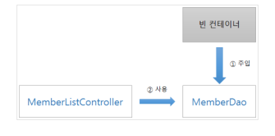

# DI를 이용한 빈 의존성 관리

MemberListController가 작업을 수행하려면 데이터베이스로부터 회원 정보를 가져다 줄
MemberDao가 필요하다. 이렇게 특정 작업을 수행할 때 사용하는 객체를 '의존 객체'라고
하고, 이런 관계를 '의존 관계(dependency') 라고 한다.

### 의존 객체의 관리
의존 객체 관리에는 필요할 때마다 의존 객체를 직접 생성하는 고전적인 방법에서부터
외부에서 의존 객체를 주입해 주는 최근의 방법까지 다양한 방안이 존재한다. 
고전적인 방법부터 살펴보면

`의존 객체가 필요하면 즉시 생성`

고전적인방법 :
의존 객체를 사용하는 쪽에서 직접 그 객체를 생성하고 관리한다.
```java
@Override
	public void doGet(
			HttpServletRequest request, HttpServletResponse response)
			throws ServletException, IOException{
        try{
        ServletContext sc=this.getServletContext();
        Connection conn=(Connection)sc.getAttribute("conn");

        MemberDao memberDao=new MemberDao();
        memberDao.setConnection(conn);

        request.setAttribute("members",memberDao.selectList());

        response.setContentType("text/html; charset=UTF-8");
        RequestDispatcher rd=request.getRequestDispatcher(
        "/member/MemberList.jsp");
        }
}
}
```

회원 목록 데이터를 가져오기 위해 직접 MemberDao 객체를 생성하고 있다.
이 방식의 문제는 doGet()이 호출 될 때마다 MemberDao  객체를 생성하기 때문에
비효율적이다.

`의존 객체를 미리 생성해 두었다가 필요할 때 사용`

위의 방법을 조금 개선한 것이 사용할 객체를 미리 생성해 두고 필요할 때마다
꺼내 쓰는 방식이다.
웹 애플리케이션이 시작 될 때 MemberDao 객체를 미리 생성하여 ServletContext에 
보관해두고, 다음과 같이 필요할 때마다 꺼내 쓴다.

```java
@Override
	public void doGet(
			HttpServletRequest request, HttpServletResponse response)
			throws ServletException, IOException {
		try {
			ServletContext sc = this.getServletContext();
			MemberDao memberDao = (MemberDao)sc.getAttribute("memberDao");

			request.setAttribute("members", memberDao.selectList());
			
			response.setContentType("text/html; charset=UTF-8");
			RequestDispatcher rd = request.getRequestDispatcher(
					"/member/MemberList.jsp");
			rd.include(request, response);
			
```

MemberListController 또한 이 방식을 사용한다. 다만, ServletContext가 아닌
Map 객체에서 꺼낸다는 것이 다르다. 

```java
public class MemberListController implements Controller {
  @Override
  public String execute(Map<String, Object> model) throws Exception {
    // Map 객체에서 MemberDao를 꺼낸다.
    MemberDao memberDao = (MemberDao)model.get("memberDao");
    
    // 회원 목록 데이터를 Map 객체에 저장한다.
    model.put("members", memberDao.selectList());
    
    // 화면을 출력할 페이지의 URL을 반환한다.
    return "/member/MemberList.jsp";
  }
}
```

### 의존 객체와의 결합도 증가에 따른 문제

위와 같이 의존 객체를 직접 생성하거나 보관소에서 꺼내는 방식으로 관리하다 보니
문제가 발생하게 되었다.

`코드의 잦은 변경`

의존 객체를 사용하는 쪽과 의존 객체(또는 보관소) 사이의 결합도가 높아져서
의존 객체나 보관소에 변경이 발생하면 바로 영향을 받는다. 예를 들어 의존 객체의
기본 생성자가 public에서 private으로 바뀐다면 의존 객체를 생성하는 모든 코드를
변경해주어야 한다. 보관소도 마찬가지이다. 보관소가 변경되면
그 보관소를 사용하는 모든 코드를 변경해야 한다.


`대체가 어렵다`


### 의존 객체를 외부에서 주입

초창기 객체 지향 프로그래밍에서는 의존 객체를 직접 생성하였다.
그러다가 위에서 언급한 문제를 해결하기 위해 의존 객체를 외부에서 주입받는
방식(Dependency Injection)으로 바뀌게 된다.



위의 그림과 같이 의존 객체를 전문으로 관리하는 
'빈 컨테이너(Java Beans Container)'가 등장하게 되었다.

빈 컨테이너는 객체가 실행 되기 전에 그 객체가 필요로 하는 의존 객체를 주입해주는
역할을 수행한다. 이런 방식으로 의존 객체를 관리하는 것을 
'의존성 주입(DI : Dependency Injection'이라 한다.
좀 더 일반적인 말로 '역 제어(IoC; Inversion Of Control'라고 부른다.

즉 역제어 방식의 한 예가 의존성 주입이다.


### 인터페이스를 활용하여 공급처를 다변화 하자

고객사들이 오라클을 사용하 수도 있고 MySQL이나 MS-SQL을 사용할 수도 있다.
그래서 각 데이터베이스에 맞추어 DAO 클래스를 준비해야 하는데,
문제는 데이터베이스를 바꿀 때마다 DAO 클래스를 사용하는 코드도 변경해야 한다.
몇 개 정도는 힘들고 번거로워도 할 수 있겠지만, 몇십 개가 넘어가면
이건 재앙이다

이런 경우에 인터페이스를 활용하면 손쉽게 해결할 수 있다.

바로 의존 객체를 사용할 때 구체적으로 클래스 이름을 명시하는 대신에
인터페이스를 사용하면, 그 자 리에 다양한 구현체(인터페이스를 구현한 클래스)를
놓을 수 있다. 즉 인터페이스라는 문법으로 DAO가 갖춰야 할 규격을 정의하고,
그 규격을 준수하는 클래스라면 어떤 클래스를 상속 받았는지 따지지 않고
허용한다는 것이다.
