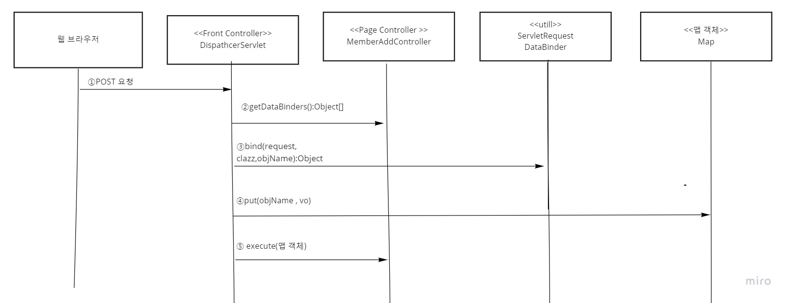

# 리플랙션 API를 이용하여 프런트 컨트롤러 개선하기

현재 까지 작업한 프런트 컨트롤러는 안타깝게도 페이지 컨트롤러를 추가할 때 마다
코드를 변경해야 한다. 특히 매개변수 값을 받아서 VO 객체를 생성하는 부분에 
많은 손이 간다. 다음 코드를 보자

```java
if ("/member/add.do".equals(servletPath)) {
        if (request.getParameter("email") != null) {
          model.put("member", new Member()
            .setEmail(request.getParameter("email"))
            .setPassword(request.getParameter("password"))
            .setName(request.getParameter("name")));
        }
```

위의 코드는 페이지 컨트롤러 'MemberAddController'를 위해서 신규 회원
등록에 필요한 데이터를 준비하는 코드이다. 사용자가 입력한 매개변수 값으로부터
Member 객체를 생성한 후 Map 객체에 저장한다.

회원 정보를 변경하는 경우에는 MemberUpdateController를 위해서 
다음과 같이 Member 객체를 준비해야 한다.앞의 신규 회원 등록과 다른 점은 password
값은 설정하지 않고 no 매개변수 값을 추가로 설정하였다.

```java
else if ("/member/update.do".equals(servletPath)) {
        if (request.getParameter("email") != null) {
          model.put("member", new Member()
            .setNo(Integer.parseInt(request.getParameter("no")))
            .setEmail(request.getParameter("email"))
            .setName(request.getParameter("name")));
```

매개변수 값에 대해 이런 식으로 VO 객체를 준비하게 되면, 데이터를
사용하는 페이지 컨트롤러를 추가 할 때 마다 계속 프론트 컨트롤러를 변경해야
하는 문제가 발생한다. 이것은 유지 보수를 매우 어렵게 만든다.

그래서 이제 리플랙션 API를 활용하여 인스턴스를 자동 생성하고,
메서드를 자동으로 호출하는 방법을 배울 것이다.


### 신규 회원 정보 추가 자동화





1. 웹 브라우저는 회원 등록을 요청한다. 사용자가 입력한 매개변수 값을 서블릿에 전달한다.

2. 프런트 컨트롤러 'DispathcerServlet'은 회원 등록을 처리하는 페이지 컨트롤러에게 어떤
   데이터가 필요한지 물어본다. 페이지 컨트롤러 'MemberAddController'는 작업하는데 필요한
   데이터의 이름과 타입 정보를 담은 배열을 리턴한다.

3. 프런트 컨트롤러는 ServletRequestDataBinder를 이용하여, 요청 매개변수로부터 페이지
   컨트롤러가 원하는 형식의 값 객체(예: Member , Integer , Date 등)를 만든다.

4. 프런트 컨트롤러는 페이지 컨트롤러 'MemberAddController'를 실행한다.
   페이지 컨트롤러의 execute()를 호출 할 때, 값이 저장된 Map 객체를 매개변수로 넘긴다.

5. 프런트 컨트롤러는 페이지 컨트롤러 'MemberAddController'를 실행한다. 페이지 컨트롤러의
   execute()를 호출할 때, 값이 저장된 Map객체를 매개변수로 넘긴다.


`DataBinding 인터페이스 정의`

실행 시나리오에서 프런트 컨트롤러가 페이지 컨트롤러를 실행하기 전에 원하는 데이터가 무엇인지
묻는다고 했다. 이것에 대해 호출 규칙을 정의해 놓겠다. 프런트 컨트롤러 입장에서는
이 규칙을 준수하는 페이지 컨트롤러를 호출할 때만 VO 객체를 준비하면 된다.

```java

public interface DataBinding {
	Object[] getDataBinders();

}
```

페이지 컨트롤러 중에서 클라이언트가 보낸 데이터가 필요한 경우 이 DataBinding 인터페이스를
구현한다. getDataBinders()의 반환값은 데이터의 이름과 타입 정보를 담은 Object의
배열입니다.

배열을 작성하는 형식
```java
new Object[]{ "데이터 이름",데이터타입,"데이터 이름","데이터타입"...}
```

데이터 이름과 데이터 타입(Class 객체)이 한 쌍으로 순서대로 오도록 작성한다.
따라서 배열의 크기는 항상 짝수여야 한다.


`프런트 컨트롤러의 변경`

DispatcherServlet.java

```java
@WebServlet("*.do")
public class DispatcherServlet extends HttpServlet {
	private static final long serialVersionUID = 1L;

	public DispatcherServlet() {
		super();
	}

	@Override
	protected void service(HttpServletRequest request, HttpServletResponse response)
			throws ServletException, IOException {
		response.setContentType("text/html; charset=UTF-8");
		String servletPath = request.getServletPath();
		try {
			ServletContext sc = this.getServletContext();

			HashMap<String, Object> model = new HashMap<String, Object>();
			model.put("session", request.getSession());

			Controller pageController = (Controller) sc.getAttribute(servletPath);
			
			if (pageController instanceof DataBinding) {
				prepareRequestData(request, model, (DataBinding) pageController);
			}
			String viewUrl = pageController.execute(model);

			for (String key : model.keySet()) {
				request.setAttribute(key, model.get(key));
			}

			if (viewUrl.startsWith("redirect:")) {
				response.sendRedirect(viewUrl.substring(9));
				return;
			} else {
				RequestDispatcher rd = request.getRequestDispatcher(viewUrl);
				rd = request.getRequestDispatcher(viewUrl);
				rd.include(request, response);
			}
		} catch (Exception e) {
			e.printStackTrace();
			request.setAttribute("error", e);
			RequestDispatcher rd = request.getRequestDispatcher("/Error.jsp");
			rd.forward(request, response);

		}

	}

	private void prepareRequestData(HttpServletRequest request, HashMap<String, Object> model, DataBinding dataBinding)
			throws Exception {
		Object[] dataBinders = dataBinding.getDataBinders();
		String dataName = null;
		Class<?> dataType = null;
		Object dataObj = null;
		for (int i = 0; i < dataBinders.length; i += 2) {
			dataName = (String) dataBinders[i];
			dataType = (Class<?>) dataBinders[i + 1];
			dataObj = ServletRequestDataBinder.bind(request, dataType, dataName);
			model.put(dataName, dataObj);
		}
	}
}
```

### 리플랙션 API

리플랙션 API 도구가 없다면 클래스에 어떤 메서드가 있는지, 메서드의 이름은 무엇인지,
클래스의 이름은 무엇인지 알 수 가 없다. '리플랙션(Reflection)'의 한글 뜻을 보면
"어떤 것에 대한 설명 또는 묘사", "거울 등에 비친 모습"이다.

즉 클래스나 메서드의 내부 구조를 들여다 볼 때 사용하는 도구라는 뜻이다.
이번 절에 사용한 리플랙션 API를 정리해 보면 다음 표와 가탇.


| 메서드 | 설명
| ----|:----|
|Class.nesInstance() | 주어진 클래스의 인스턴스를 생성|
|Class.getName() | 클래스의 이름을 반환 |
|Class.getMethods() | 클래스에 선언된 모든 public 메서드의 목록을 배열로 반환
|Method.invoke() | 해당 메서드를 호출
|Method.getParameterTypes() | 메서드의 매개변수 목록을 배열로 반환 |
