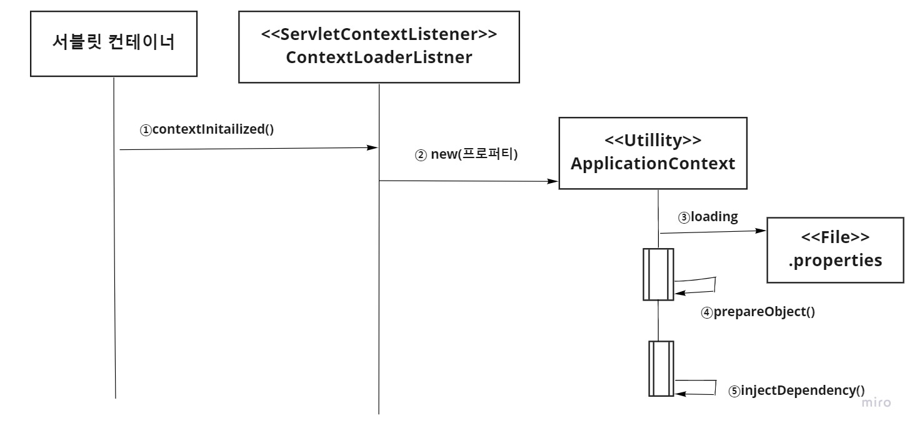

# 프로퍼티를 이용한 객체 관리
이전에 리플랙션 API를 사용하여 프런트 컨트롤러를 개선하였다.
이제 페이진 컨트롤러를 추가하더라도 프런트 컨트롤러를 손댈 필요가 없어졌다.
하지만 ContextLoaderListner는 변경해야 한다. ContextLoaderListner에서 페이지 컨트롤러
객체를 생성하기 때문이다. 
다음은 ContextLoaderListner에서 페이지 컨트롤러를 생성하는 코드의 일부분
`ContextLoaderListner.java`의 일부분
```java
	
BoardDao boardDao = new BoardDao();
boardDao.setDataSource(ds);
			
UserDao userDao = new UserDao();
userDao.setDataSource(ds);
			
sc.setAttribute("/auth/login.do", new LogInController().setUserDao(userDao));
sc.setAttribute("/auth/logout.do", new LogOutController());
sc.setAttribute("/board/list.do", new BoardListController().setBoadDao(boardDao));
```

페이지 컨트롤러뿐만 아니라 DAO를 추가하는 경우에도 ContextLoaderLister 클래스에 
코드를 추가해야 한다.

이제 이 부분, 객체를 생성하고 의존 객체를 주입하는 부분을 자동화해보자

### 실습 시나리오

웹 애플리케이션을 시작할 때 생성해야 할 객체가 있다면 
프로퍼티 파일(application-context.properties)에 기록한다.



1. 웹 애플리케이션이 시작되면 서블릿 컨테이너는 ContextLoaderListener의
contextInitialized() 메서드를 호출한다.
   
2. contextInitialized() 메서드에서는 ApplicationContext를 생성한다.
이때 생성자에 프로퍼티 파일의 경로를 매개변수로 넘겨준다.
   
3. ApplicationContext는 프로퍼티 파일의 내용을 읽어들인다.

4. 프로퍼티 파일에 선언된 대로 객체를 생성하여 객체 테이블에 저장한다.

5. 객체 테이블에 저장된 각 객체에 대해 의존 객체를 찾아서 할당 해준다.

시나리오 대로 실행된다면 페이지 컨트롤러나 DAO를 만들 때마다 더 이상 ContextLoaderListner
를 변경할 필요가 없게 된다.


### 프로퍼티 파일 작성

생성할 객체에 대한 정보를 담고 있는 프로퍼티 파일 생성

application-context.properties

```properties
jndi.dataSource = java:comp/env/jdbc/cony
BoardDao = board.dao.BoardDao
/board/list.do = board.controller.BoardListController
/board/add.do = board.controller.BoardAddController
/board/update.do = board.controller.BoardUpdateController
/board/delete.do = board.controller.BoardDeleteController
```


`톰캣 서버에서 제공하는 객체`

DataSource 처럼 톰캣 서버에서 제공하는 객체는 ApplicationContext에서 생성 할 수 없다.
대신 InitialContext 를 통해 해당 객체를 얻어야 한다. 다음은 이런 종류의 객체를 설정하는 규칙이다.

>
> jndi. {객체이름} = {JNDI 이름}


프로퍼티의 키(key)는 'jndi.'와 객체 이름을 결합하여 작성한다. 
프로퍼티의 값(value)는 톰캣 서버에 등록된 객체의 JNDI 이름이다.
위의 프로퍼티 파일에서 첫 번째 줄의 내용이 톰캣 서버가 제공하는 DataSource 객체에 대한 것이다.

> jndi.datasource = java.comp/env/jdbc/cony


### ApplicationContext 클래스
ApplicationContext 클래스는 프로퍼티 파일에 설정된 객체를 준비하는 일을 한다. 